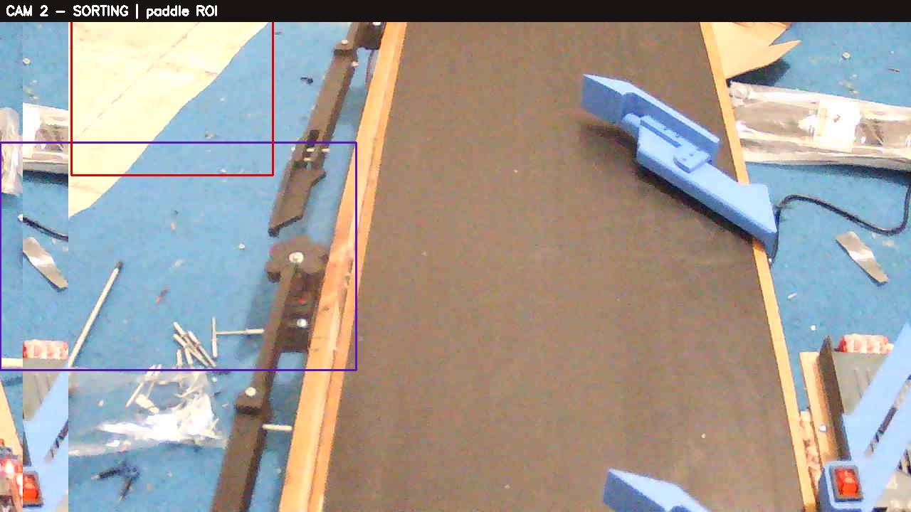
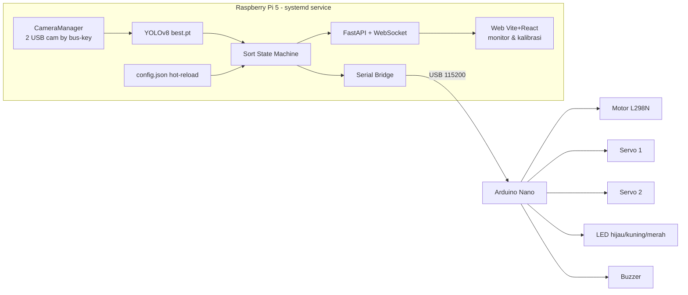
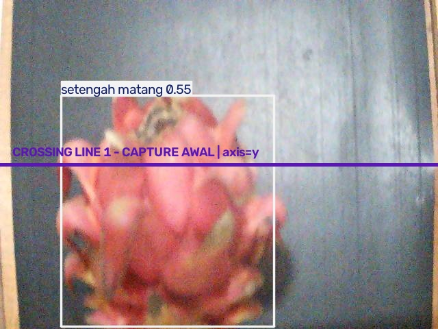
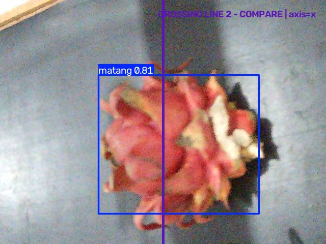
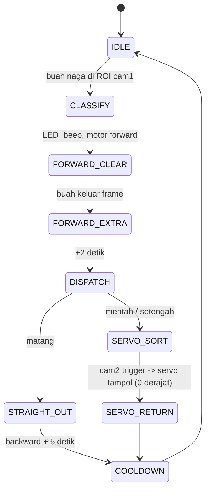

# 🐉 PemilahBuahNaga

**Sistem konveyor pemilah buah naga otomatis** berbasis **Raspberry Pi 5 + YOLOv8 + Arduino Nano**.
Kamera mendeteksi & mengklasifikasi tingkat kematangan buah naga secara real-time, lalu konveyor
dan lengan servo menyortirnya ke jalur yang sesuai — **berjalan mandiri (offline-first)** tanpa
laptop dan tanpa perlu membuka web.

<p align="center">
  
</p>

> Deteksi & keputusan sortasi 100% dijalankan di Raspberry Pi 5. Web (Vite + React) hanya untuk
> **monitoring & kalibrasi** — sistem tetap menyortir walau web ditutup atau internet mati.

---

## ✨ Fitur

- 🍎 **Klasifikasi 3 kelas** kematangan: `matang`, `setengah matang`, `mentah` (YOLOv8).
- 🎥 **Dual kamera USB** — Kamera 1 deteksi + klasifikasi, Kamera 2 tracking gerakan saat sorting.
- 🔀 **Sortasi otomatis** via 2 lengan servo + konveyor (motor L298N) dengan mekanisme "tampol".
- 🧠 **State machine** lengkap dengan **failsafe**: watchdog motor, auto-reconnect serial, E-STOP.
- 🌐 **Web monitoring & kalibrasi** (offline/LAN): stream langsung, editor ROI visual, hot-reload config.
- 🔌 **Identifikasi kamera by USB bus-key** — cam1/cam2 tidak pernah tertukar walau reboot.
- ⚙️ **Systemd service** — otomatis menyala saat boot.

---

## 🧩 Arsitektur



Semua inti (YOLO + state machine + serial) berada di **satu service Python** yang selalu berjalan.
Web adalah build statik yang di-serve service yang sama.

---

## 🔩 Hardware

| Komponen | Detail |
|---|---|
| **Compute** | Raspberry Pi 5 (BCM2712, 4×Cortex-A76 @2.4GHz, 8GB) — Debian 13 |
| **Mikrokontroler** | Arduino Nano (ATmega328P) via USB serial `/dev/ttyUSB0` @115200 |
| **Kamera** | 2× USB camera (DV20/Jieli) — cam1 deteksi, cam2 sorting |
| **Aktuator** | Motor DC konveyor (driver L298N), 2× Servo, 3× LED, Buzzer |

### Pinout Arduino Nano
| Pin | Fungsi | | Pin | Fungsi |
|---|---|---|---|---|
| D2 / D3 | Motor L298N IN1 / IN2 | | D11 | LED hijau (matang) |
| D4 / D5 | Servo 1 / Servo 2 | | D12 | LED kuning (setengah matang) |
| D6 | Buzzer | | D13 | LED merah (mentah) |

---

## 🍎 Model YOLOv8

Model `best.pt` (3 kelas). Contoh deteksi pada belt:

<p align="center">
  
  
</p>

| Index | Kelas | Aksi sortasi |
|---|---|---|
| 0 | `matang` | 🟢 Lurus keluar (tanpa servo) |
| 1 | `mentah` | 🔴 Servo 1 (paling dekat) |
| 2 | `setengah matang` | 🟡 Servo 2 |

**Performa di Pi 5** (CPU, 4 thread): imgsz 480 ≈ **5 FPS**, imgsz 320 ≈ **10 FPS**.
Bisa ~2× lebih cepat dengan export NCNN.

---

## ⚙️ Alur Kerja (State Machine)



1. **Kamera 1** mendeteksi buah naga di area hitam → mengunci kelas kematangan (LED + beep).
2. Konveyor **maju** hingga buah keluar frame, lalu **+2 detik**.
3. **Matang** → konveyor **mundur** lurus sampai keluar, +5 detik.
4. **Mentah/Setengah** → servo terkait **buka 51°**, konveyor mundur, **Kamera 2** melacak buah;
   saat buah mencapai lengan servo & posisi cukup ke kiri → servo **snap ke 0° ("tampol")** menyortir buah.
5. Watchdog & E-STOP menjaga keamanan; motor otomatis berhenti bila terjadi anomali.

---

## 📁 Struktur Proyek

```
PemilahBuahNaga/
├─ ArduinoNanoFirmware/main/main.ino   # firmware (LED hasil, buzzer, heartbeat failsafe)
├─ core/                               # service Python (offline-first)
│  ├─ main.py            # bootstrap semua komponen + web (port 8000)
│  ├─ config.py / config.json          # parameter kalibrasi (hot-reload)
│  ├─ camera.py          # 2 kamera by USB bus-key
│  ├─ detector.py        # wrapper YOLOv8
│  ├─ state_machine.py   # logika sorting
│  ├─ serial_bridge.py   # serial Arduino (auto-reconnect + heartbeat)
│  ├─ store.py           # SQLite riwayat
│  ├─ api.py             # FastAPI + WebSocket + MJPEG
│  ├─ pemilah-core.service            # unit systemd
│  └─ best.pt            # model YOLOv8
├─ web/                                # Vite + React (monitor & kalibrasi)
│  └─ src/{App, pages/Monitor, pages/Settings, components/RoiEditor}
├─ MainProgramRaspi/camera_identifier.py   # utilitas identifikasi kamera
└─ docs/                               # dokumentasi + gambar
```

---

## 🚀 Instalasi

### 1. Raspberry Pi (core service)
```bash
git clone https://github.com/Keyzoo0/PemilahBuahNaga.git
cd PemilahBuahNaga
python3 -m venv .venv
.venv/bin/pip install -r core/requirements.txt
# torch CPU untuk ARM (tanpa CUDA):
.venv/bin/pip install torch torchvision --index-url https://download.pytorch.org/whl/cpu
```

### 2. Firmware Arduino
```bash
arduino-cli compile --fqbn arduino:avr:nano ArduinoNanoFirmware/main/main.ino
arduino-cli upload  --fqbn arduino:avr:nano --port /dev/ttyUSB0 ArduinoNanoFirmware/main/main.ino
```

### 3. Web (opsional, untuk monitoring)
```bash
cd web && npm install && npm run build   # hasil ke web/dist, di-serve otomatis oleh core
```

### 4. Jalankan
```bash
./core/run.sh                # manual
# buka http://<ip-raspi>:8000
```

### 5. Auto-start saat boot (systemd)
```bash
sudo cp core/pemilah-core.service /etc/systemd/system/
sudo systemctl daemon-reload
sudo systemctl enable --now pemilah-core
journalctl -u pemilah-core -f
```

---

## 🎛️ Kalibrasi (via Web)

Semua parameter di `core/config.json`, dapat diubah dari halaman **Kalibrasi** (hot-reload, tanpa restart):

| Grup | Yang diatur |
|---|---|
| **ROI deteksi (cam1)** | Area hitam tempat buah dihitung (editor visual seret kotak) |
| **ROI paddle (cam2)** | Zona lengan servo + `slap_x_ratio` (ambang "agak ke kiri" pemicu tampol) |
| **Deteksi** | `imgsz`, confidence, min box area, presence/exit frames |
| **Timing** | Forward +2s, backward matang +5s, sudut servo 51°/0°, cooldown, watchdog |
| **Mapping** | Kelas → servo1 / servo2 / lurus |
| **Kamera & Serial** | bus-key, resolusi, port, baud |

Tersedia juga **mode manual** untuk menguji motor/servo/buzzer satu per satu saat kalibrasi.

---

## 📟 Protokol Serial (Arduino)

| Command | Fungsi |
|---|---|
| `result <matang\|setengah\|mentah\|none>` | LED hasil + beep |
| `motor <forward\|backward\|stop>` | Konveyor |
| `s1/s2 <open\|close>` | Servo 51° / 0° |
| `beep <n>` · `buzzer <on\|off>` | Buzzer |
| `ping` · `watchdog <on\|off>` | Keep-alive & failsafe motor |

Indikator: 🟢 matang · 🟡 setengah matang · 🔴 mentah · ketiga LED kedip + buzzer = **FAULT**.

---

## 🛡️ Keamanan & Failsafe

- **Watchdog motor**: bila buah tak terdeteksi keluar dalam batas waktu → motor berhenti + alarm.
- **Heartbeat firmware**: bila Pi diam >2 dtk saat motor jalan → Arduino menghentikan motor sendiri.
- **Auto-reconnect** serial & kamera. **E-STOP** dari web kapan saja.

---

## 📝 Lisensi

Proyek edukasi/riset. Model YOLO menggunakan Ultralytics (AGPL-3.0).

**Dibuat oleh [Keyzoo0](https://github.com/Keyzoo0)** — 2026.
