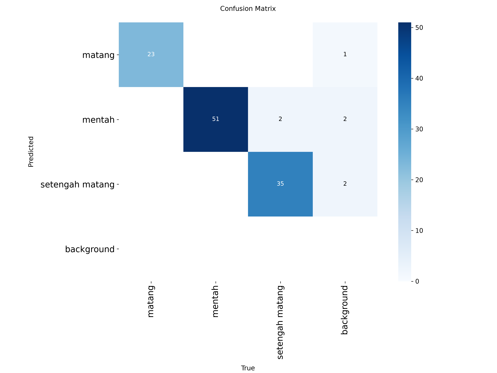
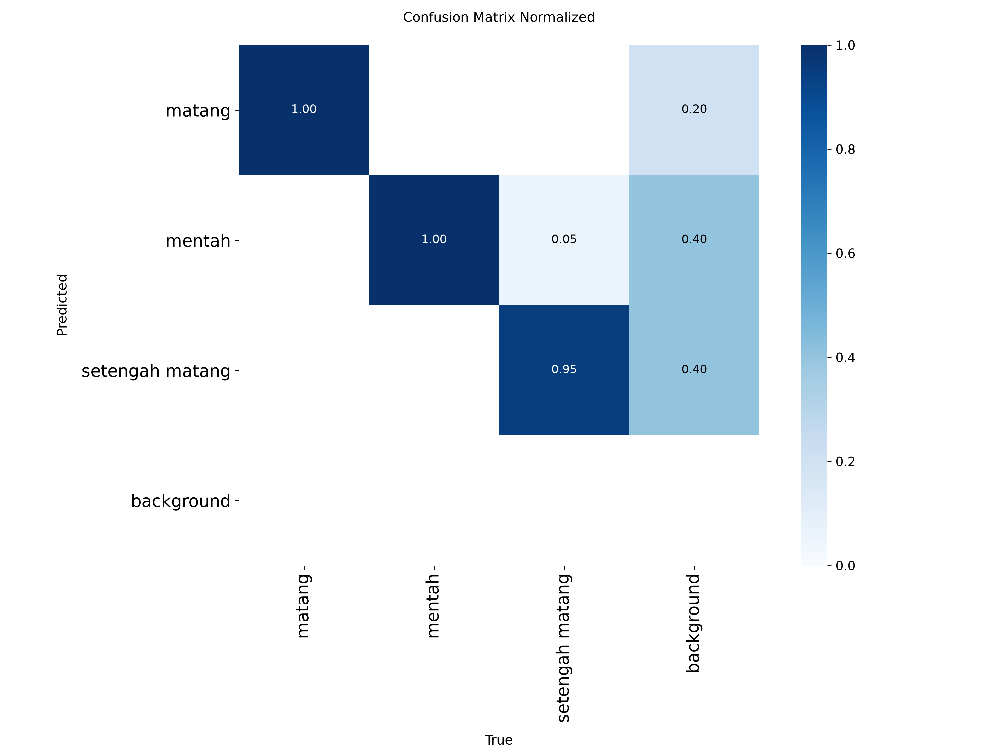
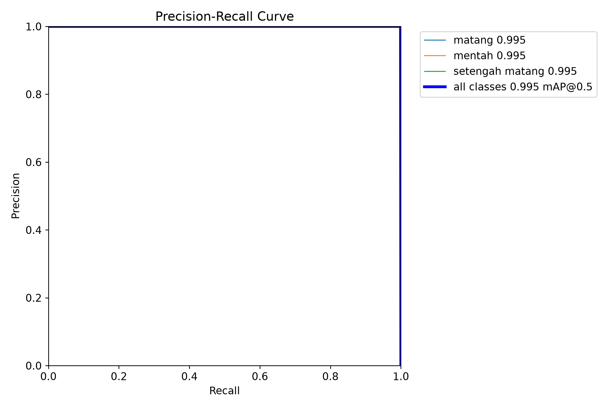

# Hasil Evaluasi Model (Confusion Matrix)

Model: `core/best.pt` (YOLOv8, 3 kelas: `matang`, `mentah`, `setengah matang`)
Dataset validasi: `core/dataset/_build` (111 gambar val)

Dihasilkan dari `model.val()` pada 2026-09-28 karena seluruh run training di
`core/runs/train_*` dijalankan dengan `plots: false` sehingga tidak pernah
menyimpan confusion matrix sebelumnya. File ini dibuat dengan menjalankan
validasi ulang model yang sudah ada terhadap dataset yang sama (bukan
training ulang dari nol).

## Ringkasan metrik

| Kelas            | Precision | Recall | mAP50 | mAP50-95 |
|------------------|-----------|--------|-------|----------|
| all              | 0.980     | 0.991  | 0.995 | 0.764    |
| matang           | 0.980     | 1.000  | 0.995 | 0.800    |
| mentah           | 0.959     | 1.000  | 0.995 | 0.752    |
| setengah matang  | 1.000     | 0.973  | 0.995 | 0.738    |

## Confusion Matrix

